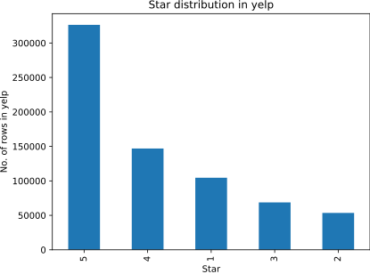
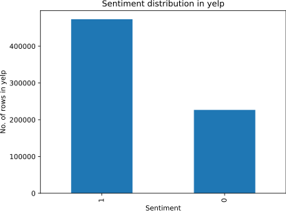
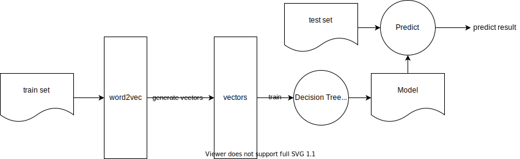

# Sentiment Analysis

> Author: Yangyi Zou

## 1. Dataset Chose

### 1.1 Introduce to Yelp

**Yelp** is a famous merchant review website in the United States. Founded in 2004, it includes merchants in restaurants, shopping centers, hotels, tourism and other fields. Users can score merchants, submit comments and exchange shopping experience on yelp website. If you search yelp for a restaurant or hotel, you can see its brief introduction and the comments of netizens. How many stars will the reviewers give? Usually, the reviewers are consumers who have personally experienced the service of the merchant, and most of the comments are vivid and detailed.

### 1.2 Yelp Reviews

**Yelp reviews** is an open source dataset released by **Yelp** for learning purposes. It contains comments from millions of users, business attributes and more than 200000 photos from multiple metropolitan areas. This is a commonly used global NLP challenge data set, containing 5.2 million comments and 174000 business attributes. The data set download address is:

> https://www.yelp.com/dataset/download

The data in *Yelp reviews* dataset is stored in JSON and SQL formats. Taking JSON format as an example, each review contains the following contents:

```json
{
  // string, 22 character unique review id
  "review_id": "KU_O5udG6zpxOg-VcAEodg",
  
  // string, 22 character unique user id, maps to the user in user.json
  "user_id": "mh_-eMZ6K5RLWhZyISBhwA",
  
  // string, 22 character business id, maps to business in business.json
  "business_id": "XQfwVwDr-v0ZS3_CbbE5Xw",
  
  // integer, star rating
  "stars": 3.0,
  
  // integer, number of useful votes received
  "useful": 0,
  
  // integer, number of funny votes received
  "funny": 0,
  
  // integer, number of cool votes received
  "cool": 0,
  
  // string, the review itself
  "text": "If you decide to eat here, just be aware it is going to take about 2 hours from beginning to end. We have tried it multiple times, because I want to like it! I have been to it\u0027s other locations in NJ and never had a bad experience. \n\nThe food is good, but it takes a very long time to come out. The waitstaff is very young, but usually pleasant. We have just had too many experiences where we spent way too long waiting. We usually opt for another diner or restaurant on the weekends, in order to be done quicker.",
  
  // string, date formatted YYYY-MM-DD
  "date": "2018-07-07 22:09:11"
}
```

Because the *yelp reviews* dataset is relatively large and there is no direct link to download, this paper first downloads the JSON format dataset from [Yelp Dataset | Kaggle](https://www.kaggle.com/datasets/yelp-dataset/yelp-dataset) and divides it into ten small files, each containing 100000 comments. The sorted dataset is uploaded to GitHub, which can be obtained from here => [zoeyyyzou/yelp (github.com)](https://github.com/zoeyyyzou/yelp)

## 2. Data preprocessing

> [Sentiment Classification using Word Embeddings (Word2Vec) | by Dipika Baad | The Startup | Medium](https://medium.com/swlh/sentiment-classification-using-word-embeddings-word2vec-aedf28fbb8ca)

This project will select 40w reviews from *Yelp reviews* dataset for sentiment analysis, and the number of positive and negative reviews in the selected 40w reviews should be equal. This paper will complete the data cleaning through the following steps：

### 2.1 Load yelp dataset

First, load yelp datasets from JSON format file (which download from  [zoeyyyzou/yelp (github.com) ](https://github.com/zoeyyyzou/yelp)), then use `pandas` to save it to csv format. 

```python
def load_yelp_orig_data():
    data = []
    for file in ds_yelp_files:
        with open(f"{ds_yelp}{os.sep}{file}", "r") as f:
            data += f.readlines()

    # remove the trailing "\n" from each line
    data = map(lambda x: x.rstrip(), data)

    data_json_str = "[" + ','.join(data) + "]"

    # now, load it into pandas
    data_df = pd.read_json(data_json_str)
    data_df.to_csv(ds_yelp_csv)
load_yelp_orig_data()
```

Once the above function has been run, you are ready to load it in pandas dataframe for the next steps. 

### 2.2 Exploring data

Fist, display stars counts, then plotting the star distribution to svg.



Then, mapping from stars to sentiment is done and distribution for each sentiment is plotted. 

> The project stipulates that **stars > 3 is positive** sentiment and **stars < = 3** is negative sentiment

```python
def map_sentiment(stars_received):
    if stars_received <= 3:
        return 0
    else:
        return 1
data_df['sentiment'] = [map_sentiment(x) for x in data_df['stars']]
```



As can be seen from the above figure, a total of **473275** reviews in the current data set are **positive** and **226725** reviews are **negative**.

In order to ensure the same number of positive and negative samples, we use the following code to take 200000 samples from each of the positive and negative samples for subsequent processing, and save to csv file.

```python
def get_top_data(data_df, top_n=200000):
    top_data_df_positive = data_df[data_df['sentiment'] == 1].head(top_n)
    top_data_df_negative = data_df[data_df['sentiment'] == 0].head(top_n)
    top_data_df_small = pd.concat([top_data_df_positive, top_data_df_negative])
    return top_data_df_small
  
data_df = data_df.loc[data_df['text'].str.len() > 20]
data_df = get_top_data(data_df, top_n=200000)
data_df.to_csv(ds_yelp_csv_after_extraction)
```

### 2.3 Data cleaning

Before model training, we need to clean the datasets, we will clean the data according to the following steps.

1. **Remove stop words.**

   In the field of sentiment analysis, because stop words are usually related to emotional expression, this paper does not remove stop words from samples. For example,  `remove_stopwords("I did not like the food!!")` => `I like food!!`。

   In the above example, after removing the stop word, the emotion changes from negative to positive.

2. **Tokenization**

   ```python
   data_df['tokenized_text'] = [simple_preprocess(line, deacc=True) for line in tqdm(data_df['text'])]
   ```

   We use ` simple_process` provided by **gensim** to tokenize for each review text. This function supports the following functions:

   - Make all words lowercase.
   - Remove punctuation.
   - Use the `min` and `max` parameters to filter out too short and too long tokens.

3. **Stemming**

   We use `PorterStemmer` provided by gensim for mapping words to its root form.

   ```python
   from gensim.parsing.porter import PorterStemmer,
   
   porter_stemmer = PorterStemmer()
   data_df['stemmed_tokens'] = [[porter_stemmer.stem(word) for word in tokens] for tokens in
                                tqdm(data_df['tokenized_text'])]
   ```

4. For generate hypertext and fasttext datasats, we need to merge all token to one sentences.

   ```python
   data_df['text'] = [" ".join(tokens) for tokens in tqdm(data_df['tokenized_text'])]
   
   # 4. save to scv
   data_df.to_csv(ds_yelp_csv_after_data_cleaning)
   ```

### 2.4 Split datasets

In order to test the accuracy of each model under different sample sizes, we need to generate data sets of different sizes, and divide each data set into training set, verification set and test set.

```python
def split_dataset(sampleNum: int, train_ratio: float = 0.6, dev_ratio: float = 0.2, test_ratio: float = 0.2):
    data_df = pd.read_csv(ds_yelp_csv_after_data_cleaning)
    train_count, dev_count, test_count = int(sampleNum * train_ratio), int(sampleNum * dev_ratio), int(
        sampleNum * test_ratio)
    train_count_each, dev_count_each, test_count_each = int(train_count / 2), int(dev_count / 2), int(test_count / 2)
    negative_datas = data_df.query("sentiment==0")
    positive_datas = data_df.query("sentiment==1")
    train_df = shuffle(pd.concat([negative_datas.iloc[:train_count_each], positive_datas.iloc[:train_count_each]]))
    dev_df = shuffle(pd.concat([negative_datas.iloc[train_count_each:train_count_each + dev_count_each],
                                positive_datas.iloc[train_count_each:train_count_each + dev_count_each]]))
    test_df = shuffle(pd.concat(
        [negative_datas.iloc[train_count_each + dev_count_each:train_count_each + dev_count_each + test_count_each],
         positive_datas.iloc[train_count_each + dev_count_each:train_count_each + dev_count_each + test_count_each]]))

    return train_df, dev_df, test_df
```

### 2.5 Generate datasets of different sizes for FastText

Hypertext model requires the input data to conform to the following format：

```bash
<text> __label__<label>

# for example
I like this food!	__label__1
```

We use the following code to generate data sets with a total sample size of 1w, 10w, 20w and 40w. For each data set, we divide it into training set (60%), verification set (20%) and test set (20%).

> When training the fasttext model, we did not use the validation set, but in order to keep consistent with hypertext, we generated the validation set

```python
ds_yelp_fasttext_config = {
    "yelp_fasttext_1w": {
        "dirname": "yelp_fasttext_1w",
        "path": f"{dataset_dir}{os.sep}yelp_fasttext_1w",
        "count": 10000
    },
    "yelp_fasttext_10w": {
        "dirname": "yelp_fasttext_10w",
        "path": f"{dataset_dir}{os.sep}yelp_fasttext_10w",
        "count": 100000
    },
    "yelp_fasttext_20w": {
        "dirname": "yelp_fasttext_20w",
        "path": f"{dataset_dir}{os.sep}yelp_fasttext_20w",
        "count": 200000
    },
    "yelp_fasttext_40w": {
        "dirname": "yelp_fasttext_40w",
        "path": f"{dataset_dir}{os.sep}yelp_fasttext_40w",
        "count": 400000
    },
}

def fasttext_get_label_and_content(row) -> str:
    content = row["text"].strip("\n").replace('\t', ' ').replace("\n", '').replace("\r", '')
    label = row['sentiment']
    return "%s __label__%d\n" % (content, label)

for k, v in ds_yelp_fasttext_config.items():
    train_df, dev_df, test_df = split_dataset(v["count"])
    generate_hypertext_and_fasttext_dataset(v["path"], fasttext_get_label_and_content,
                                            train_df, dev_df, test_df)
```

### 2.6 Generate datasets of different sizes for HyperText

Hypertext model requires the input data to conform to the following format：

```bash
<text>\t<label>

# for example
I like this food!	1
```

We use the following code to generate data sets with a total sample size of 1w, 10w, 20w and 40w. For each data set, we divide it into training set (60%), verification set (20%) and test set (20%).

```python
ds_yelp_hypertext_config = {
    "yelp_hypertext_1w": {
        "dirname": "yelp_hypertext_1w",
        "path": f"{dataset_dir}{os.sep}yelp_hypertext_1w",
        "count": 10000
    },
    "yelp_hypertext_10w": {
        "dirname": "yelp_hypertext_10w",
        "path": f"{dataset_dir}{os.sep}yelp_hypertext_10w",
        "count": 100000
    },
    "yelp_hypertext_20w": {
        "dirname": "yelp_hypertext_20w",
        "path": f"{dataset_dir}{os.sep}yelp_hypertext_20w",
        "count": 200000
    },
    "yelp_hypertext_40w": {
        "dirname": "yelp_hypertext_40w",
        "path": f"{dataset_dir}{os.sep}yelp_hypertext_40w",
        "count": 400000
    },
}

def hypertext_get_label_and_content(row) -> str:
    content = row["text"].strip("\n").replace('\t', ' ').replace("\n", '').replace("\r", '')
    label = row['sentiment']
    return f"{content}\t{label}\n"
  

def generate_hypertext_and_fasttext_dataset(output_dir: str, get_label_and_content, train_df, dev_df, test_df):
    os.system(f"mkdir -p {output_dir}")
    with open(f"{output_dir}{os.sep}train.txt", "w") as f:
        for index, row in train_df.iterrows():
            res = get_label_and_content(row)
            if res:
                f.write(res)
    with open(f"{output_dir}{os.sep}dev.txt", "w") as f:
        for index, row in dev_df.iterrows():
            res = get_label_and_content(row)
            if res:
                f.write(res)
    with open(f"{output_dir}{os.sep}test.txt", "w") as f:
        for index, row in test_df.iterrows():
            res = get_label_and_content(row)
            if res:
                f.write(res)
for k, v in ds_yelp_hypertext_config.items():
  	train_df, dev_df, test_df = split_dataset(v["count"])
    generate_hypertext_and_fasttext_dataset(v["path"], hypertext_get_label_and_content,
                                            train_df, dev_df, test_df)
```

### 2.7 Generate datasets of different sizes for word2vec

The word2vec model uses the tokens as input, so we just need to dump the result of `split_dataset`

```python
ds_yelp_word2vec_config = {
    "yelp_word2vec_1w": {
        "dirname": "yelp_word2vec_1w",
        "path": f"{dataset_dir}{os.sep}yelp_word2vec_1w",
        "count": 10000
    },
    "yelp_word2vec_10w": {
        "dirname": "yelp_word2vec_10w",
        "path": f"{dataset_dir}{os.sep}yelp_word2vec_10w",
        "count": 100000
    },
    "yelp_word2vec_20w": {
        "dirname": "yelp_word2vec_20w",
        "path": f"{dataset_dir}{os.sep}yelp_word2vec_20w",
        "count": 200000
    },
    "yelp_word2vec_40w": {
        "dirname": "yelp_word2vec_40w",
        "path": f"{dataset_dir}{os.sep}yelp_word2vec_40w",
        "count": 400000
    },
}

def generate_word2vec_dataset(output_dir: str, train_df, dev_df, test_df):
    os.system(f"mkdir -p {output_dir}")
    train_df.to_csv(f"{output_dir}{os.sep}train.csv")
    dev_df.to_csv(f"{output_dir}{os.sep}dev.csv")
    test_df.to_csv(f"{output_dir}{os.sep}test.csv")

for k, v in ds_yelp_fasttext_config.items():
    train_df, dev_df, test_df = split_dataset(v["count"])
    generate_hypertext_and_fasttext_dataset(v["path"], fasttext_get_label_and_content,
                                          train_df, dev_df, test_df)
```

## 3. Model implementation

### 3.1 FastText

This paper uses the fasttext model implementation provided by [fastText](https://fasttext.cc/) to train and test the model. Use the default parameters for training, and use the tools provided by sklean to evaluate the test results.

```python
for k, v in ds_yelp_fasttext_config.items():
    dir = f"datasets{os.sep}{v['dirname']}"
    print(f"\n======================= {dir} =======================")
    start_time = time.time()
    model = fasttext.train_supervised(f"{dir}{os.sep}train.txt")
    fasttext_train_time = get_time_dif(start_time)
    print(f"fasttext train time: {fasttext_train_time}")
    predicted = []
    y_test = []
    with open(f"{dir}{os.sep}test.txt") as f:
        for line in tqdm(f.readlines()):
            line = line.strip()
            y_test.append(int(line[-1]))
            predicted.append(int(model.predict(line[:-11])[0][0][-1]))

    precision, recall, fscore, support = score(y_test, predicted)
    accuracy = accuracy_score(y_test, predicted)
    print(classification_report(y_test, predicted, target_names=["class 0", "class 1"]))
```

Output example:

```bash
======================= datasets/yelp_fasttext_1w =======================
fasttext train time: 0:00:00
              precision    recall  f1-score   support

     class 0       0.83      0.84      0.84      1000
     class 1       0.84      0.82      0.83      1000

    accuracy                           0.83      2000
   macro avg       0.83      0.83      0.83      2000
weighted avg       0.83      0.83      0.83      2000
```

### 3.2 HyperText

> [Pretrained-Language-Model/HyperText at master · huawei-noah/Pretrained-Language-Model (github.com)](https://github.com/huawei-noah/Pretrained-Language-Model/tree/master/HyperText)

This paper uses the hypertext model implementation provided by [huawei-noah](https://github.com/huawei-noah/Pretrained-Language-Model/tree/master/HyperText) to train and test the model. Use the following parameters for training:

|   Parameter name    |    Value    |
| :-----------------: | :---------: |
|      embedding      |  "random"   |
|     model_name      | "HyperText" |
|       dropout       |     0.0     |
| require_improvement |    6000     |
|     num_epochs      |      2      |
|     batch_size      |     50      |
|     max_length      |    1000     |
|    learning_rate    |   1.1e-2    |
|      embed_dim      |     20      |
|       bucket        |   1500000   |
|     wordNgrams      |      2      |
|    lr_decay_rate    |    0.96     |
|  use_word_segment   |    True     |
|      min_freq       |      1      |
|   eval_per_batchs   |     50      |

```python
def train_and_test(dataset_dir: str, output_dir: str, embedding: str = "random",
                   model_name: str = "HyperText", dropout: float = 0.0, require_improvement: int = 6000,
                   num_epochs: int = 2, batch_size: int = 50, max_length: int = 1000,
                   learning_rate: float = 1.1e-2, embed_dim: int = 20, bucket=int(1500000), wordNgrams: int = 2,
                   lr_decay_rate: float = 0.96, use_word_segment: bool = True, min_freq: int = 1,
                   eval_per_batchs: int = 50,
                   ):
    print(f"\n\n============================== Start {dataset_dir} ==============================")
    config = Config(dataset_dir, output_dir, embedding)

    # reset config
    config.model_name = model_name
    config.save_path = os.path.join(output_dir, model_name + '.ckpt')
    config.log_path = os.path.join(output_dir, model_name + '.log')
    config.dropout = dropout
    config.require_improvement = require_improvement
    config.num_epochs = num_epochs
    config.batch_size = batch_size
    config.max_length = max_length
    config.learning_rate = learning_rate
    config.embed = embed_dim
    config.bucket = bucket
    config.wordNgrams = wordNgrams
    config.lr_decay_rate = lr_decay_rate

    start_time = time.time()
    print("Loading data...")
    vocab, train_data, dev_data, test_data = build_dataset(config, use_word_segment,
                                                           min_freq=int(min_freq))
    time_dif = get_time_dif(start_time)
    print("Finished Data loaded...")
    print("Time usage:", time_dif)

    config.n_vocab = len(vocab)
    model = HyperText.Model(config).to(config.device)

    print_config(config)
    print(model.parameters)
    train(config, model, train_data, dev_data, test_data, eval_per_batchs)
    
train_and_test(f"datasets{os.sep}{v['dirname']}", f"output/20_yelp_{v['count']}", num_epochs=2,
                       min_freq=5)
```

Output example:

```bash
============================== Start datasets/yelp_hypertext_1w ==============================
Loading data...
use min words freq:5
Vocab size: 5935
label size: 2
Finished Data loaded...
Time usage: 0:00:00
hyperparamper config:
model_name=HyperText
train_path=datasets/yelp_hypertext_1w/train.txt
dev_path=datasets/yelp_hypertext_1w/dev.txt
test_path=datasets/yelp_hypertext_1w/test.txt
class_list=['0', '1']
vocab_path=datasets/yelp_hypertext_1w/vocab.txt
labels_path=datasets/yelp_hypertext_1w/labels.txt
save_path=output/20_yelp_data_cleaning_10000/HyperText.ckpt
log_path=output/20_yelp_data_cleaning_10000/HyperText.log
embedding_pretrained=None
device=cpu
dropout=0.0
require_improvement=6000
num_classes=2
n_vocab=5935
num_epochs=2
wordNgrams=2
batch_size=50
max_length=1000
learning_rate=0.011
embed=20
bucket=1500000
lr_decay_rate=0.96
<bound method Module.parameters of Model(
  (dropout): Dropout(p=0.0, inplace=False)
  (hyperLinear): MobiusLinear(in_features_size=20, out_features_size=2, curvalture=1.0)
)>
Epoch:1/2
Train Step:      0,  Train Loss: 0.6929,  Train Acc: 52.0000%,  Val Loss: 0.6927,  Val Acc: 51.0000%,  Time: 0:00:05 **
Train Step:     50,  Train Loss: 0.6109,  Train Acc: 74.0000%,  Val Loss: 0.6047,  Val Acc: 74.6500%,  Time: 0:03:53 **
Train Step:    100,  Train Loss: 0.3605,  Train Acc: 84.0000%,  Val Loss: 0.4086,  Val Acc: 81.6000%,  Time: 0:09:21 **
Epoch:2/2
Train Step:    150,  Train Loss: 0.3442,  Train Acc: 84.0000%,  Val Loss: 0.3553,  Val Acc: 85.1000%,  Time: 0:14:58 **
Train Step:    200,  Train Loss: 0.2142,  Train Acc: 92.0000%,  Val Loss: 0.3374,  Val Acc: 85.9000%,  Time: 0:20:43 **
Test Loss:   0.3,  Test Acc: 87.45%
Precision, Recall and F1-Score...
              precision    recall  f1-score   support

           0     0.8741    0.8750    0.8746      1000
           1     0.8749    0.8740    0.8744      1000

    accuracy                         0.8745      2000
   macro avg     0.8745    0.8745    0.8745      2000
weighted avg     0.8745    0.8745    0.8745      2000

Confusion Matrix...
[[875 125]
 [126 874]]
Test Time: 0:00:21
```

### 3.3 word2vec

> [Sentiment Classification using Word Embeddings (Word2Vec) | by Dipika Baad | The Startup | Medium](https://medium.com/swlh/sentiment-classification-using-word-embeddings-word2vec-aedf28fbb8ca)
>
> [models.word2vec – Word2vec embeddings — gensim (radimrehurek.com)](https://radimrehurek.com/gensim/models/word2vec.html)

In this project, we will be using gensim’s [Word2Vec](https://radimrehurek.com/gensim/models/word2vec.html) for creating the model. Some of the important parameters are as follows:

- **size**: The number of dimensions of the embeddings and the default is 100.
- **window**: The maximum distance between a target word and words around the target word. The default window is 5.
- **min_count**: The minimum count of words to consider when training the model; words with occurrence less than this count will be ignored. The default for min_count is 5.
- **workers**: The number of partitions during training and the default workers is 3.
- **sg**: The training algorithm, either CBOW(0) or skip gram(1). The default training algorithm is CBOW.

The following parameters will be used in the comparative experiment of this paper：

| Parameter name | Value |
| :------------: | :---: |
|      size      |  100  |
|     window     |   3   |
|   min_count    |   1   |
|    workers     |   4   |
|       sg       |   0   |

Because word2vec itself cannot be used to perform classification tasks, this paper will use Decision Tree and SVM model to complete sentiment analysis tasks. The specific process is shown in the figure below：



- First combine the training set and test set and input them into wordvec model for training.

  ```python 
  def train_word2vec(input_dir, output_dir, size: int = 100, window: int = 3, min_count: int = 1,
                     workers: int = 4, sg: int = 0):
      word2vec_model_file = f"{output_dir}{os.sep}word2vec_{str(size)}.model"
  
      data_df = pd.concat([pd.read_csv(f"{input_dir}{os.sep}train.csv"), pd.read_csv(f"{input_dir}{os.sep}test.csv")])
  
      start_time = time.time()
      stemmed_tokens = pd.Series(data_df['stemmed_tokens']).values
      # Train the Word2Vec Model
      w2v_model = Word2Vec(stemmed_tokens, min_count=min_count, vector_size=size, workers=workers, window=window, sg=sg)
      print("Time taken to train word2vec model: " + str(time.time() - start_time))
      w2v_model.save(word2vec_model_file)
  
  train_word2vec(dir, dir, size=size)
  ```

- Secondly, feature vectors are generated based on the trained word2vec model.

  ```python
  def generate_word2vec_vectors(input_dir, output_dir, size: int = 100):
      sg_w2v_model = Word2Vec.load(f"{input_dir}{os.sep}word2vec_{str(size)}.model")
      word2vec_filename = f"{output_dir}{os.sep}train_review_word2vec.csv"
      X_train = pd.read_csv(f"{input_dir}{os.sep}train.csv")
  
      with open(word2vec_filename, 'w+') as word2vec_file:
          for index, row in X_train.iterrows():
              model_vector = (np.mean([sg_w2v_model.wv[token] for token in row['stemmed_tokens']], axis=0)).tolist()
              if index == 0:
                  header = ",".join(str(ele) for ele in range(size))
                  word2vec_file.write(header)
                  word2vec_file.write("\n")
              # Check if the line exists else it is vector of zeros
              if type(model_vector) is list:
                  line1 = ",".join([str(vector_element) for vector_element in model_vector])
              else:
                  line1 = ",".join([str(0) for i in range(size)])
              word2vec_file.write(line1)
              word2vec_file.write('\n')
  
  train_decision_tree(dir, dir)
  ```

- Thirdly, a decision tree / SVM model is trained using the feature vector generated in the previous step.

  ```python
  def train_decision_tree(input_dir, output_dir):
      word2vec_filename = f"{output_dir}{os.sep}train_review_word2vec.csv"
      Y_train = pd.read_csv(f"{input_dir}{os.sep}train.csv")
  
      # Load from the filename
      word2vec_df = pd.read_csv(word2vec_filename)
      # Initialize the model
      clf_decision_word2vec = DecisionTreeClassifier()
  
      start_time = time.time()
      # Fit the model
      clf_decision_word2vec.fit(word2vec_df.values, Y_train['sentiment'])
      print("Time taken to fit the model with word2vec vectors: " + str(time.time() - start_time))
  
      with open(f'{output_dir}/decision_tree_model.pkl', 'wb') as f:
          pickle.dump(clf_decision_word2vec, f)
  
  def train_SVM(input_dir, output_dir):
      word2vec_filename = f"{output_dir}{os.sep}train_review_word2vec.csv"
      Y_train = pd.read_csv(f"{input_dir}{os.sep}train.csv")
  
      # Load from the filename
      word2vec_df = pd.read_csv(word2vec_filename)
      # Initialize the model
      clf_svc = SVC()
  
      start_time = time.time()
      # Fit the model
      clf_svc.fit(word2vec_df.values, Y_train['sentiment'])
      print("Time taken to fit the model with word2vec vectors: " + str(time.time() - start_time))
  
      with open(f'{output_dir}/svm_model.pkl', 'wb') as f:
          pickle.dump(clf_svc, f)
          
  train_decision_tree(dir, dir)
  train_SVM(dir, dir)
  ```

- Finally, the trained decision tree / SVM model is used for prediction.

  ```python
  def test_decision_tree(input_dir, size: int = 100):
      with open(f'{input_dir}/decision_tree_model.pkl', 'rb') as f:
          clf_decision_word2vec = pickle.load(f)
      X_test = pd.read_csv(f"{input_dir}{os.sep}test.csv")
      sg_w2v_model = Word2Vec.load(f"{input_dir}{os.sep}word2vec_{str(size)}.model")
      test_features_word2vec = []
      count = 0
      for index, row in X_test.iterrows():
          model_vector = (np.mean([sg_w2v_model.wv[token] for token in row['stemmed_tokens']], axis=0)).tolist()
          if type(model_vector) is list:
              test_features_word2vec.append(model_vector)
          else:
              count += 1
              test_features_word2vec.append(np.array([0 for i in range(size)]))
      test_predictions_word2vec = clf_decision_word2vec.predict(test_features_word2vec)
      print(classification_report(X_test['sentiment'], test_predictions_word2vec))
          
  def test_SVM(input_dir, size: int = 100):
      with open(f'{input_dir}/svm_model.pkl', 'rb') as f:
          clf_svc = pickle.load(f)
      X_test = pd.read_csv(f"{input_dir}{os.sep}test.csv")
      sg_w2v_model = Word2Vec.load(f"{input_dir}{os.sep}word2vec_{str(size)}.model")
      test_features_word2vec = []
      for index, row in X_test.iterrows():
          model_vector = (np.mean([sg_w2v_model.wv[token] for token in row['stemmed_tokens']], axis=0)).tolist()
          if type(model_vector) is list:
              test_features_word2vec.append(model_vector)
          else:
              test_features_word2vec.append(np.array([0 for i in range(size)]))
      test_predictions_word2vec = clf_svc.predict(test_features_word2vec)
      print(classification_report(X_test['sentiment'], test_predictions_word2vec))
      
  test_decision_tree(dir, size=size)
  test_SVM(dir, size=size)
  ```

Output example:

```bash
======================= datasets/yelp_word2vec_1w =======================
1. Start train word2vec
Time taken to train word2vec model: 8.335594892501831
2. Start  generate word2vec vectors
3. Start train decision tree
Time taken to fit the model with word2vec vectors: 0.5006928443908691
Decision tree train time: 0:00:14
4. Start test decision tree
              precision    recall  f1-score   support

           0       0.58      0.55      0.56      1000
           1       0.57      0.60      0.59      1000

    accuracy                           0.57      2000
   macro avg       0.57      0.57      0.57      2000
weighted avg       0.57      0.57      0.57      2000

5. train SVM
Time taken to fit the model with word2vec vectors: 1.8713669776916504
SVM train time: 0:00:15
6. test SVM
              precision    recall  f1-score   support

           0       0.61      0.77      0.68      1000
           1       0.69      0.50      0.58      1000

    accuracy                           0.64      2000
   macro avg       0.65      0.64      0.63      2000
weighted avg       0.65      0.64      0.63      2000
```

## 4. Build

### 4.1 Get code and install requirements

```bash
git clone https://github.com/zoeyyyzou/sentiment-analysis
cd sentiment-analysis
python3 -m venv venv
source venv/bin/activate
pip install -r requirements.txt
```

### 4.2 Get datasets

```bash
!mkdir -p datasets/yelp
!git clone https://github.com/zoeyyyzou/yelp.git datasets/yelp
```

### 4.3 Do data preprocessing

```bash
cd data_preprocessor
python preprocessor.py
```


